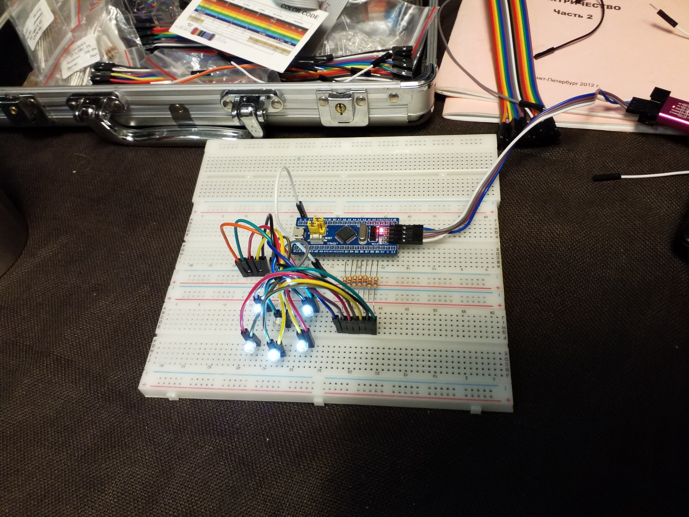
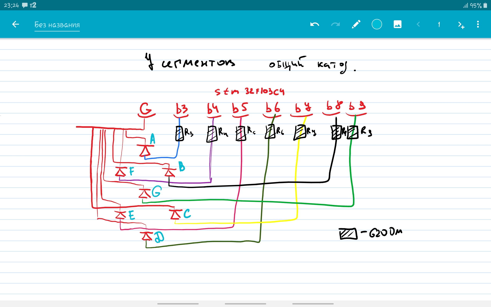

# custom 7 segment display by leds
## ugly but works!

main.c contains loop which iterates through led number codes for displaying concrete number.

### Upd1:
 PB11 used for listening HIGT signal about button press. When buttom is pressed next number is displaying.

* MCU - stm32f103c4
* STM32CubeMX was used for initiating of ports
* STM32CubeIDE was used
* [stm32 tutors](http://mypractic.ru/urok-1-vvedenie-obshhie-svedeniya-skoree-vpechatleniya-ob-stm32.html)

### Upd2
Bought normal 7 segment indicator with shared anode. Revert set signals to reset. And get good indication of numbers.
![view2][imgs/view_2.jpg]
![pin_scheme_2][imgs/pin_scheme_2.jpg]
